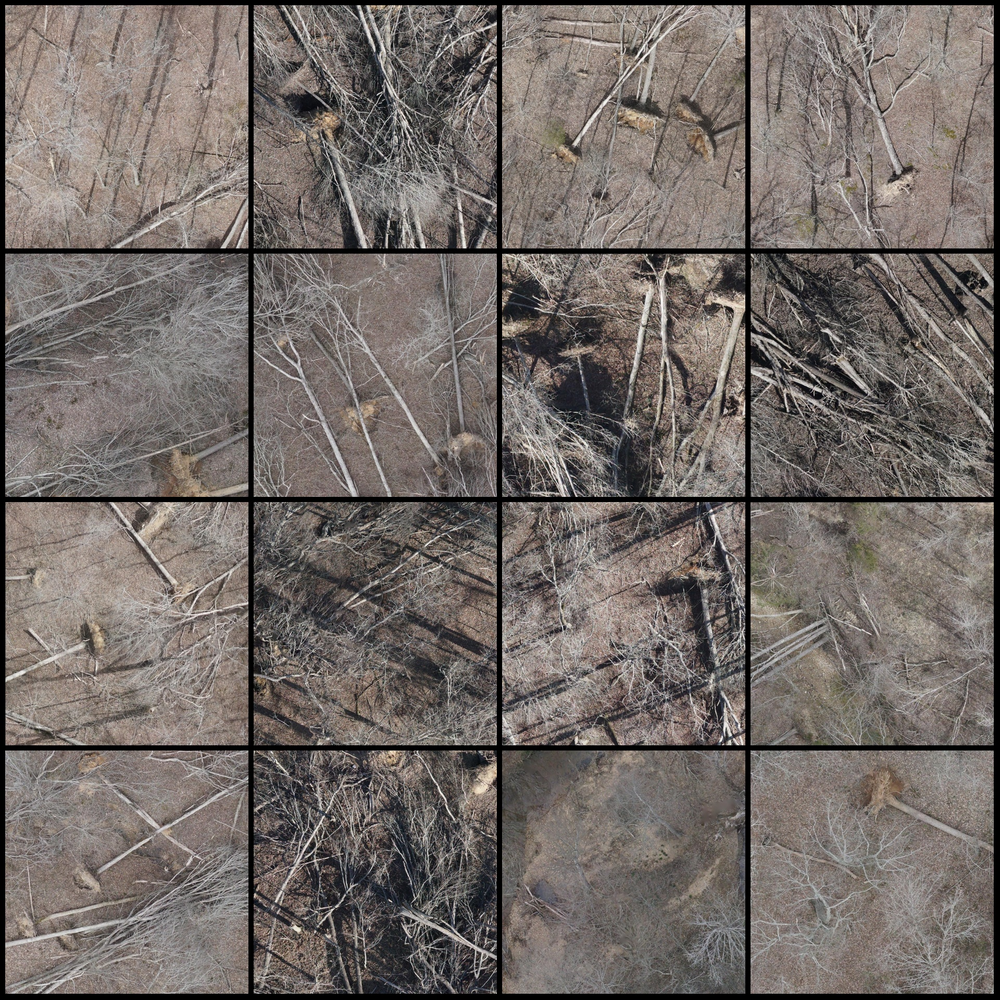
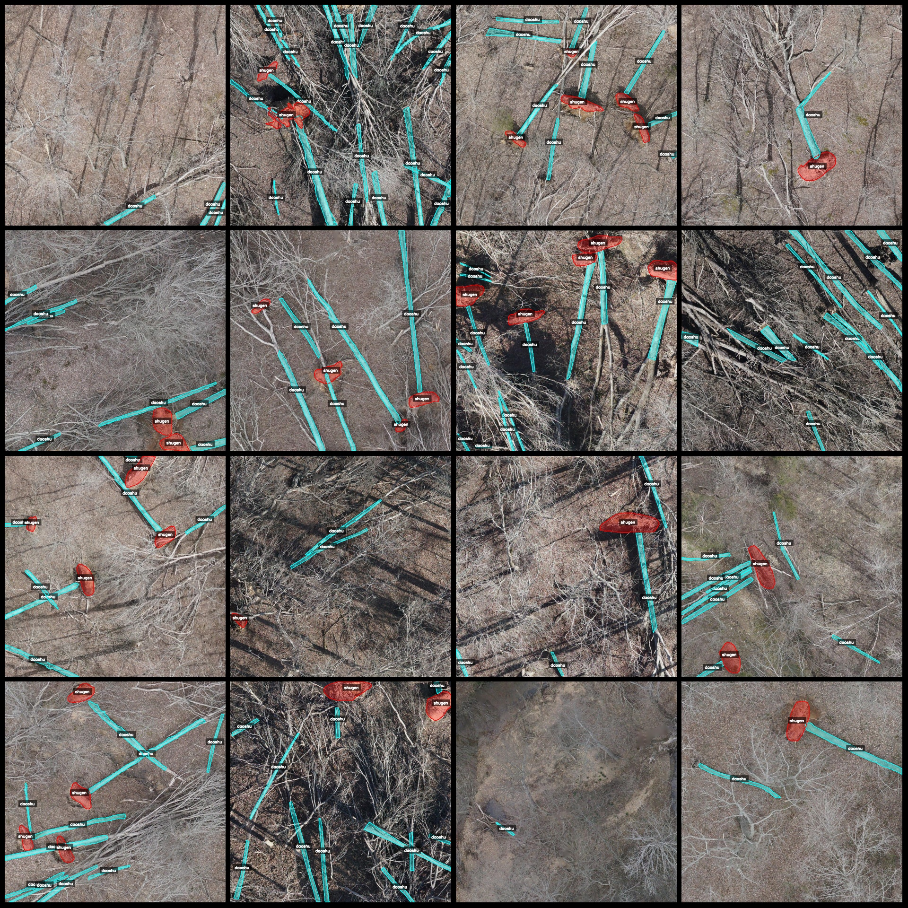
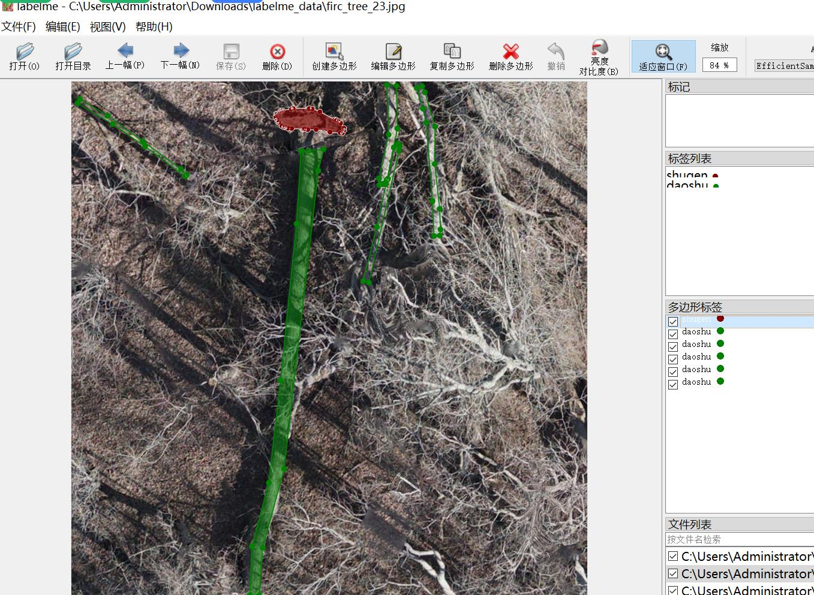

# Drone Perspective Intelligent Forestry Uprooting Tree Root Identification and Segmentation Dataset (LabelMe Format) - 5026 Images in 2 Categories

The dataset format is LabelMe without the mask file, only including JPG images and their corresponding JSON files.

- Number of Image Files (JPG): 5026
- Number of Annotation Files (JSON): 5026
- Number of Annotation Categories: 2
- Annotation Category Names: ["daoshu", "shugen"]
- Box Count for Each Category:
  - daoshu (uprooted tree) count = 43430
  - shugen (tree root) count = 12000
- Total Boxes: 55430

The usage of the labeling tool: LabelMe v5.5.0

Image Resolution: 1024x1024

Annotation rules: Polygon box is drawn around the category.

Important Notice: The dataset can be edited using LabelMe, but the JSON data set needs to be converted into either Yolo or Coco format for semantic segmentation or instance segmentation.

Special Statement: This dataset does not guarantee the accuracy of the trained model or weight files.

Image Preview:

Annotation Examples:
- Randomly selected 16 images:

Annotation drawing results:

LabelMe editing example:

Image

Here is a pay link on Stripe ( https://buy.stripe.com/3cs8yP7sY87d0vu9AB ). Please contact me lonlonago@foxmail.com after funding $89, and I will send you a complete data files , thank you!

